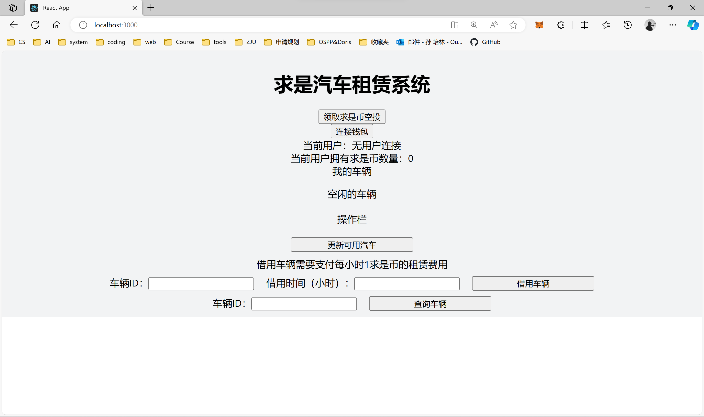
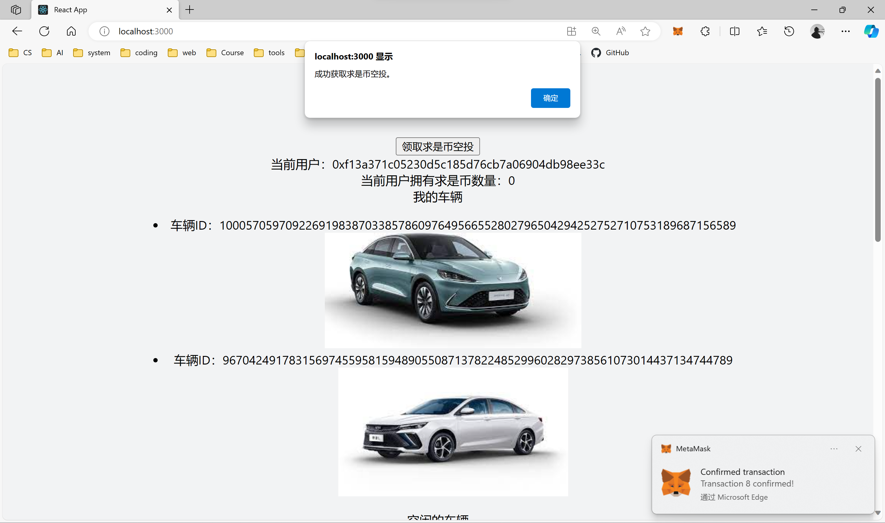
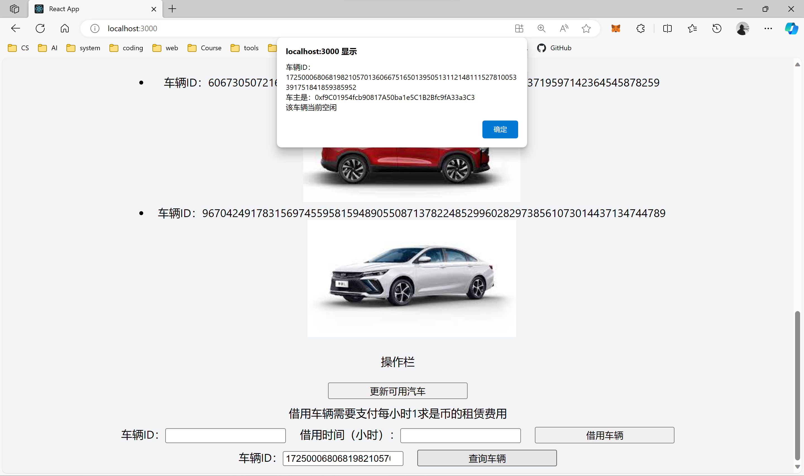
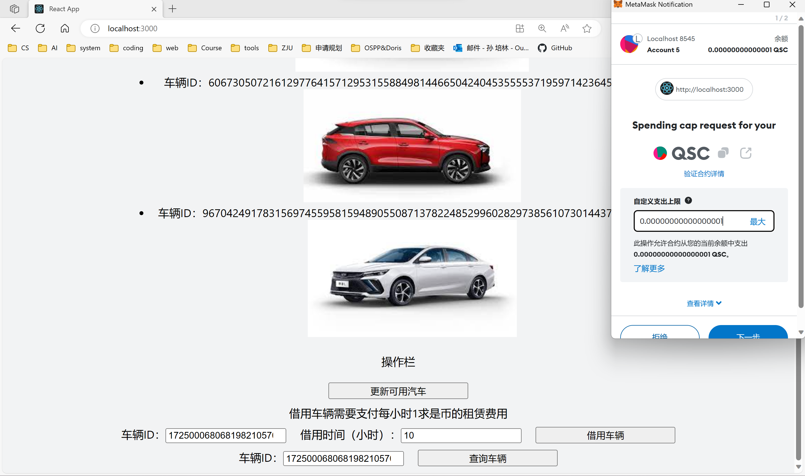
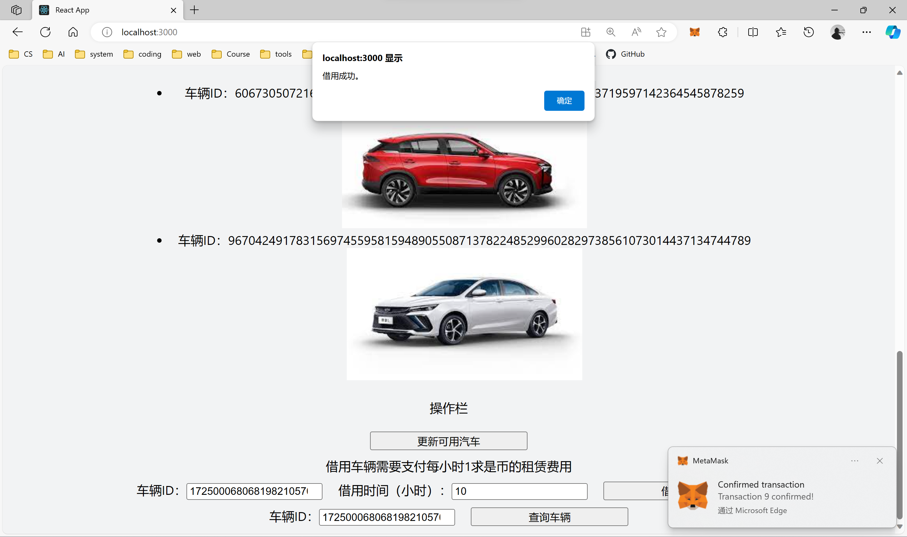
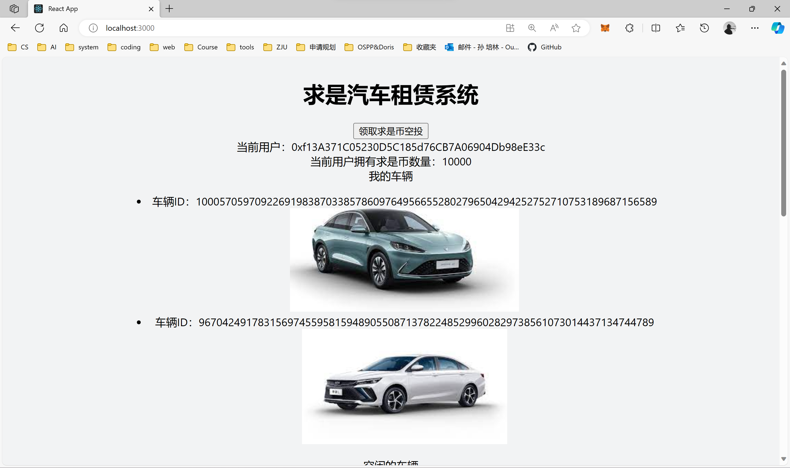
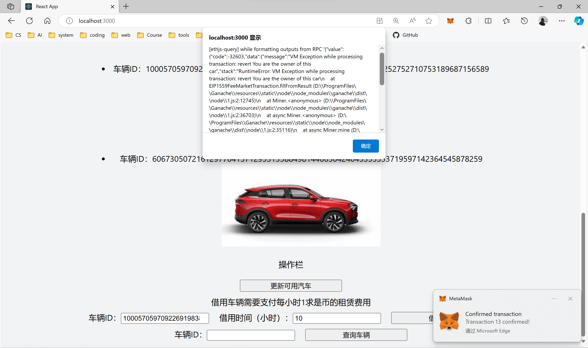
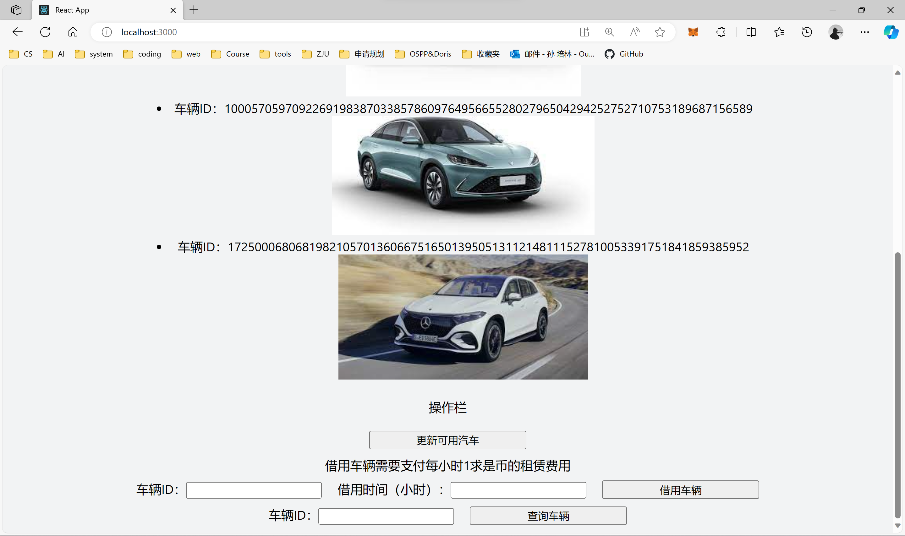

# 求是汽车租赁系统

## 如何运行

1. 在本地启动ganache应用并选择或创建一条测试链。

2. 在 `./contracts` 中安装需要的依赖，运行如下的命令：
    ```bash
    npm install
    ```
    
3. 在 `./contracts` 中编译合约，运行如下的命令：
    ```bash
    npx hardhat compile
    ```
    
4. 在 `./contracts` 中部署合约到ganache测试链上，运行如下的命令：

    `npx hardhat run ./scripts/deploy.ts --network ganache`

    将输出的合约部署地址填写到`./frontend/src/utils/contract-addresses.json`中

5. 复制`./contracts/artifacts/contracts/BorrowYourCar.sol/BorrowYourCar.json`和`./contracts/artifacts/contracts/QiushiToken.sol/QiushiToken.json`到`./frontend/src/utils/abis`中

6. 在 `./frontend` 中安装需要的依赖，运行如下的命令：
    ```bash
    npm install
    ```

7. 在 `./frontend` 中启动前端程序，运行如下的命令：

    ```bash
    npm run start
    ```


8. 在安装了MetaMask插件的浏览器中访问http://localhost:3000/以使用本系统。

## 功能实现分析

1. **查看自己拥有的汽车列表，查看当前还没有被借用的汽车列表。**

   在BorrowYourCar合约中维护用户id到用户拥有的汽车列表的映射，当前还没有被借用的汽车的数组，当车辆被借用、过期以及新增车辆时，对两个列表进行维护。

2. **查询一辆汽车的主人，以及该汽车当前的借用者(如果有)。**

   在BorrowYourCar合约中维护汽车id到汽车结构体的映射，在汽车结构体中保存汽车的主人和当前借用者，通过映射即可实现查询，注意查询借用者时要注意检查借用是否已经过期。

3. **选择并借用某辆还没有被租借的汽车一定时间。**

   当收到用户请求借用车辆时，合约首先检查车辆是否存在以及用户是否有足够的余额支付租赁费用，满足条件的情况下完成车辆租赁，并维护车辆信息、空闲车辆列表和已租车辆列表。在车辆过期后，通过更新可用汽车功能合约会将其状态更新为空闲并将其加入可用车辆队列中。

4. **使用自己发行的基于ERC20的积分求是币付费租赁汽车。**

   使用继承ERC20的QiushiToken合约发行积分求是币，用户使用求是币支付租赁费用。当用户需要支付租赁费用时，需要先向BorrowYourCar合约授权相应费用，然后由BorrowYourCar合约在进行汽车租赁时完成支付。

## 项目运行截图

备注：若图片不能正常查看请参考readme.pdf文件。

进入求是汽车租赁系统，此时尚未连接账户。



使用小狐狸连接到钱包，显示用户当前求是币数量、我的车辆列表、空闲车辆列表。


领取求是币空投，刷新页面后会看到求是币增加。



使用查询车辆按钮查询ID为17250006806819821057013606675165013950513112148111527810053391751841859385952的车辆的信息，成功返回车辆信息。



借用ID为17250006806819821057013606675165013950513112148111527810053391751841859385952的车辆，可以看到小狐狸钱包要求支付求是币（QSC）作为租赁费用，同时要求支付调用合约所需的燃料ETH。



点击下一步支付租赁费用后，提示借用成功。

/screenshot/image-20231022185148326.png

查看当前求是币数量为10000。



刷新界面，发现求是币减少10的租赁费用。


使用查询车辆按钮再次查询ID为17250006806819821057013606675165013950513112148111527810053391751841859385952的车辆的信息，显示借用者为当前用户0xf13A371C05230D5C185d76CB7A06904Db98eE33c。


再次尝试借用ID为17250006806819821057013606675165013950513112148111527810053391751841859385952的车辆，发现借用失败，已被借用的车辆在过期前不能再次被借用。


尝试借用ID为100057059709226919838703385786097649566552802796504294252752710753189687156589的车辆，发现借用失败，不能借用自己拥有的车辆。



租用时间10小时结束后，点击更新可用汽车按钮，合约所有租赁已经过期的车辆状态设置为空闲，并加入空闲车辆列表中，我们可以看到ID为17250006806819821057013606675165013950513112148111527810053391751841859385952的车辆已经重新出现在空闲车辆列表中。



## 参考内容

- 课程的参考Demo见：[DEMOs](https://github.com/LBruyne/blockchain-course-demos)。

- ERC-4907 [参考实现](https://eips.ethereum.org/EIPS/eip-4907)


